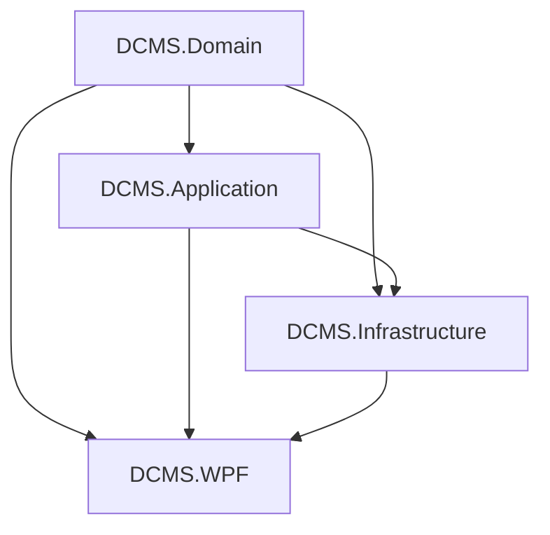

# 🏗️ DCMS Technical Architecture

This document provides a technical overview of the Document Correspondence Management System (DCMS) architecture and implementation details.

## 🏛️ Architectural Pattern: Clean Architecture

The project is built using **Clean Architecture** principles to ensure separation of concerns, testability, and independence from external frameworks.

### 1. DCMS.Domain (Core Layer)
- **Purpose:** Contains all business entities, enums, and core logic.
- **Dependencies:** None. This is the heart of the system.
- **Key Files:**
    - `Entities/`: `Inbound.cs`, `Outbound.cs`, `User.cs`, etc.
    - `Enums/`: `UserRole.cs`, `CorrespondenceStatus.cs`.

### 2. DCMS.Application (Service Layer)
- **Purpose:** Defines the business use cases and interfaces.
- **Dependencies:** `DCMS.Domain`.
- **Key Components:**
    - `Interfaces/`: `IAiService`, `ICorrespondenceService`.
    - `DTOs/`: Data Transfer Objects for UI communication.

### 3. DCMS.Infrastructure (Data & External Services)
- **Purpose:** Implements the interfaces defined in the Application layer. Handles database access and external API integrations.
- **Dependencies:** `DCMS.Domain`, `DCMS.Application`.
- **Key Components:**
    - `Data/`: `DCMSDbContext` (EF Core).
    - `Services/`: `AiChatService` (AI integration), `CorrespondenceService`.
    - `Migrations/`: Database version control.

### 4. DCMS.WPF (Presentation Layer)
- **Purpose:** The user interface built with WPF and following the **MVVM** pattern.
- **Dependencies:** All other layers.
- **Key Components:**
    - `Views/`: XAML files for the UI.
    - `ViewModels/`: Logic for the views.
    - `Services/`: UI-specific services like `NotificationService`, `IdleDetectorService`.

---

## 🤖 AI Integration Details

The system integrates AI through the `AiChatService` in the Infrastructure layer.
- **Provider:** Supports Google Gemini / OpenAI.
- **Features:** 
    - Retrieval of correspondence data to answer user queries.
    - Document content analysis.
    - Automated reply suggestions.

---

## 🔐 Security & Permissions

### Role-Based Access Control (RBAC)
Supported roles defined in `UserRole.cs`:
- `Admin`: Full system access.
- `OfficeManager`: Broad management permissions.
- `TechnicalManager`: Focused on technical follow-up.
- `FollowUpStaff`: Data entry and basic tracking.

### Audit Logging
Every data modification is captured in the `AuditLog` table, storing:
- Who performed the action.
- When it was performed.
- Old vs. New values (JSON format).

---

## 📊 Database Schema

The system uses Entity Framework Core with a code-first approach.
Primary Tables:
- `Inbounds` / `Outbounds`: Correspondence records.
- `Users`: Authentication and role data.
- `Meetings` / `CalendarEvents`: Scheduling data.
- `Notifications`: Real-time user alerts.

---

## 🛠️ Tech Stack

- **Platform:** .NET 8.0
- **UI:** WPF with MaterialDesignInXAML
- **Data:** EF Core with SQL Server/PostgreSQL
- **Patterns:** Clean Architecture, MVVM, Repository/Service Pattern.
